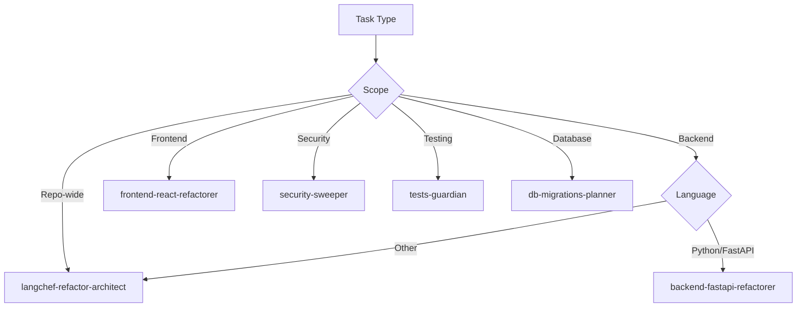

# Claude Code Agent Overview

This documentation provides guidance for Claude Code and its specialized sub-agents when working with the LangChef codebase.

## Available Sub-Agents

### 🏗️ **langchef-refactor-architect**
**Purpose**: Repo-wide refactor orchestration and planning
**Tools**: Read, Grep, Glob, Bash, Edit
**Use**: For comprehensive refactoring plans, architectural analysis, and coordinating complex changes
**Triggers**: After significant edits or commits, architectural reviews

### ⚡ **backend-fastapi-refactorer** 
**Purpose**: FastAPI/Python refactoring specialist
**Tools**: Read, Grep, Glob, Edit
**Focus**: Enforces layering (routers→services→repositories), type safety, config hygiene, error handling
**Use**: Backend code improvements, API refactoring, Python best practices

### ⚛️ **frontend-react-refactorer**
**Purpose**: React refactoring specialist  
**Tools**: Read, Grep, Glob, Edit
**Focus**: Component extraction, API layer isolation, state management, prop drilling reduction
**Use**: Frontend improvements, React best practices, component architecture

### 🔒 **security-sweeper**
**Purpose**: Security vulnerability detection and remediation
**Tools**: Read, Grep, Glob, Bash, Edit
**Focus**: Secrets, CORS, input validation, auth flaws, safe fixes
**Use**: Security audits, vulnerability remediation, security best practices

### 🧪 **tests-guardian**
**Purpose**: Test scaffolding and repair
**Tools**: Read, Grep, Glob, Bash, Edit
**Focus**: Unit/integration tests, test coverage, CI improvements
**Use**: Test development, coverage improvements, quality assurance

### 🗄️ **db-migrations-planner**
**Purpose**: Database migration planning and generation
**Tools**: Read, Grep, Glob, Bash, Edit
**Focus**: Safe Alembic migrations, no destructive ops without approval
**Use**: Database schema changes, migration planning

## Agent Usage Guidelines

### When to Use Which Agent

### Coordination Between Agents

1. **langchef-refactor-architect** acts as the orchestrator
2. Specialized agents handle domain-specific tasks
3. **security-sweeper** should be run after any major changes
4. **tests-guardian** ensures quality throughout the process

### Best Practices

#### For All Agents:
- Always read existing code before making changes
- Follow existing patterns and conventions
- Make incremental, safe changes
- Validate changes don't break functionality
- Update documentation when needed

#### For Refactoring Agents:
- Use TodoWrite tool to track complex tasks
- Test changes thoroughly
- Consider performance implications
- Maintain backward compatibility

#### For Security Agent:
- Prioritize critical vulnerabilities
- Provide clear remediation steps
- Don't break functionality while fixing security issues
- Document security improvements

## Project-Specific Context

### LangChef Architecture
- **Backend**: FastAPI with SQLAlchemy ORM
- **Frontend**: React with Material-UI
- **Database**: PostgreSQL with Alembic migrations
- **Authentication**: JWT with AWS SSO integration
- **Infrastructure**: Docker containerization

### Key Files to Understand
- `CLAUDE.md` - Project instructions and development commands
- `backend/config.py` - Configuration management
- `backend/main.py` - FastAPI application entry point
- `frontend/src/contexts/AuthContext.js` - Authentication state
- `frontend/src/services/api.js` - API client

### Common Patterns
- Backend routes follow: `routes/ → services/ → models/`
- Frontend components use Material-UI theming
- Database operations use async SQLAlchemy
- Authentication uses JWT tokens
- Environment configuration via .env files

### Security Considerations
- Never commit secrets or API keys
- Use proper input validation
- Implement CORS correctly
- Follow secure authentication patterns
- Validate all user inputs

## Agent Communication

When working together, agents should:
1. Reference this documentation for consistency
2. Use the TodoWrite tool for task coordination
3. Follow the established patterns in CLAUDE.md
4. Communicate changes that affect other domains
5. Run security sweeps after significant changes