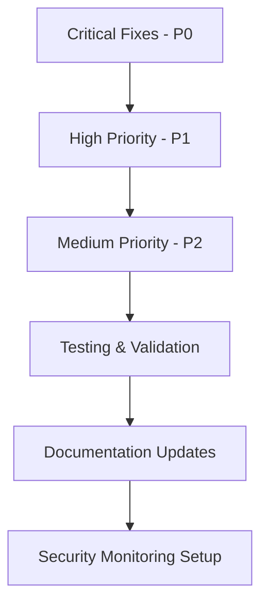

# Security Implementation Guide for Claude Code Agents

**Priority**: 📋 IMPLEMENTATION GUIDE  
**Agent Assignment**: All agents (`security-sweeper`, `backend-fastapi-refactorer`, `frontend-react-refactorer`, `langchef-refactor-architect`)  
**Status**: 📚 Reference Document  

## 🎯 Purpose

This guide provides Claude Code agents with step-by-step instructions for implementing all security fixes identified in the LangChef security audit. It ensures consistent, systematic remediation across all components.

---

## 🚀 Quick Start for Agents

### Before You Begin

1. **Read the security audit overview**: `/security-audit/README.md`
2. **Identify your component**: Backend, Frontend, Infrastructure, or Cross-cutting
3. **Start with Critical fixes**: Always address `/remediation-plans/critical-fixes.md` first
4. **Follow the implementation order**: Critical → High → Medium priority

### Implementation Order



---

## 📋 Agent-Specific Implementation Plans

### For `security-sweeper` Agent

**Primary Responsibility**: Critical security vulnerabilities and cross-cutting security concerns

#### Phase 1: Critical Fixes (2-3 hours)
1. **Fix CORS Configuration** (`/backend/main.py`)
   - Replace wildcard origins with environment-specific allowlist
   - Test with browser and curl requests
   
2. **Implement Token Revocation** (`/backend/core/token_blacklist.py`)
   - Set up Redis-based token blacklist
   - Add revocation endpoint
   - Update authentication middleware

3. **Fix Environment Configuration** (`/backend/core/secure_config.py`)
   - Generate strong SECRET_KEY
   - Move AWS credentials to encrypted storage
   - Add configuration validation

#### Phase 2: Infrastructure Security (2-3 hours)
4. **Docker Security** (`/docker-compose.secure.yml`)
   - Implement non-root containers
   - Add security profiles and capability restrictions
   - Configure resource limits

5. **Security Headers** (`/backend/middleware/security_headers.py`)
   - Implement comprehensive HTTP security headers
   - Configure Content Security Policy
   - Add HSTS for production

#### Validation Checklist:
- [ ] CORS requests from unauthorized origins return 403
- [ ] Revoked tokens return 401 when used
- [ ] Strong SECRET_KEY generates without warnings
- [ ] Containers run as non-root users
- [ ] Security headers present in all responses

### For `backend-fastapi-refactorer` Agent

**Primary Responsibility**: Backend API security and database protection

#### Phase 1: Authentication & Authorization (2-3 hours)
1. **Password Security** (`/backend/core/password_security.py`)
   - Implement strong password validation
   - Add bcrypt hashing with proper rounds
   - Set up rate limiting for auth endpoints

2. **Database Security** (`/backend/core/database_security.py`)
   - Fix SQL injection vulnerabilities
   - Implement parameterized queries
   - Add database connection security

3. **Input Validation** (`/backend/api/schemas.py`)
   - Create secure Pydantic models
   - Add comprehensive input sanitization
   - Implement file upload validation

#### Phase 2: API Security (2-3 hours)
4. **Rate Limiting** (`/backend/middleware/rate_limiting.py`)
   - Implement Redis-based rate limiting
   - Configure endpoint-specific limits
   - Add suspicious activity detection

5. **Session Management** (`/backend/core/session_manager.py`)
   - Secure session storage in Redis
   - Implement session validation
   - Add concurrent session limits

6. **Security Logging** (`/backend/core/security_logger.py`)
   - Structured security event logging
   - Authentication event tracking
   - Admin action auditing

#### Validation Checklist:
- [ ] Weak passwords rejected during registration
- [ ] SQL injection attempts blocked and logged
- [ ] File uploads validate type, size, and content
- [ ] Rate limits enforced on all endpoints
- [ ] Session hijacking attempts detected
- [ ] Security events logged in structured format

### For `frontend-react-refactorer` Agent

**Primary Responsibility**: Frontend security and client-side protection

#### Phase 1: Token & Storage Security (1-2 hours)
1. **Secure Token Storage** (`/frontend/src/utils/secureStorage.js`)
   - Replace localStorage with encrypted sessionStorage
   - Implement automatic token expiration
   - Add token validation checks

2. **XSS Prevention** (`/frontend/src/utils/sanitizer.js`)
   - Install and configure DOMPurify
   - Create content sanitization utilities
   - Implement safe display components

#### Phase 2: API & Component Security (2-3 hours)
3. **API Client Security** (`/frontend/src/services/secureApi.js`)
   - Implement secure API client with validation
   - Add request/response sanitization
   - Configure proper timeout and retry logic

4. **Component Security** (`/frontend/src/components/SafeDisplay.js`)
   - Create secure form components
   - Implement state validation
   - Add error boundaries for security

5. **CSP Implementation** (`/frontend/public/index.html`)
   - Configure Content Security Policy
   - Add security meta tags
   - Implement proper cache control

#### Validation Checklist:
- [ ] Tokens encrypted in sessionStorage, not localStorage
- [ ] XSS payloads neutralized by sanitization
- [ ] API requests include security headers
- [ ] Form inputs validated before processing
- [ ] CSP blocks unauthorized script execution
- [ ] Error boundaries contain component failures

### For `langchef-refactor-architect` Agent

**Primary Responsibility**: Security architecture coordination and testing

#### Phase 1: Architecture Review (1-2 hours)
1. **Component Integration** 
   - Ensure security components work together
   - Validate data flow between secure components
   - Check for security gaps in integration points

2. **Configuration Management**
   - Coordinate environment-specific configurations
   - Ensure secrets management consistency
   - Validate security settings across components

#### Phase 2: Testing & Validation (2-3 hours)
3. **Security Testing Suite**
   - Create comprehensive security tests
   - Implement automated vulnerability scanning
   - Set up continuous security monitoring

4. **Performance Impact Analysis**
   - Measure security overhead
   - Optimize critical paths
   - Ensure acceptable performance degradation

5. **Documentation & Deployment**
   - Update security documentation
   - Create deployment checklists
   - Coordinate production rollout plan

#### Validation Checklist:
- [ ] All security components integrate properly
- [ ] No conflicts between security measures
- [ ] Comprehensive test coverage for security fixes
- [ ] Performance impact within acceptable limits
- [ ] Production deployment plan validated

---

## 🔧 Implementation Workflow

### Step-by-Step Process

#### 1. Pre-Implementation Setup
```bash
# Create backup of current state
git checkout -b security-fixes-backup
git add .
git commit -m "Backup before security fixes"

# Create feature branch for security work
git checkout -b feature/security-improvements

# Set up development environment
cp .env.example .env.development
# Update .env.development with secure values
```

#### 2. Critical Fixes Implementation
```bash
# Follow critical-fixes.md in order
# Test each fix before moving to next
# Commit after each successful fix

git add backend/main.py
git commit -m "Fix: Replace wildcard CORS with secure origins"

git add backend/config.py
git commit -m "Fix: Implement strong SECRET_KEY validation" 

# Continue for all critical fixes...
```

#### 3. Validation After Each Fix
```bash
# Run security tests
python -m pytest tests/security/

# Check for regressions
python -m pytest tests/

# Verify functionality
curl -H "Origin: https://malicious.com" \
     http://localhost:8001/api/health
# Should return 403
```

#### 4. Integration Testing
```bash
# Start all services
docker-compose up -d

# Run comprehensive security scan
python scripts/security_scan.py

# Check logs for errors
docker-compose logs | grep -i error
```

#### 5. Performance Validation
```bash
# Benchmark API performance
python scripts/performance_test.py

# Check memory usage
docker stats --no-stream

# Validate response times
curl -w "@curl-format.txt" http://localhost:8001/api/prompts
```

---

## 🧪 Testing & Validation

### Automated Security Testing

**Create comprehensive test suite**:

```python
# tests/security/test_security_fixes.py
import pytest
import requests
from fastapi.testclient import TestClient
from backend.main import app
from backend.core.password_security import PasswordSecurity

client = TestClient(app)

class TestCriticalSecurityFixes:
    def test_cors_wildcard_removed(self):
        """Test CORS no longer allows wildcard origins"""
        response = client.options(
            "/api/prompts",
            headers={"Origin": "https://malicious.com"}
        )
        assert response.status_code == 403
    
    def test_strong_secret_key_enforced(self):
        """Test weak SECRET_KEY is rejected"""
        with pytest.raises(ValueError, match="Weak SECRET_KEY"):
            settings.SECRET_KEY = "weak"
            # Trigger validation
    
    def test_password_strength_validation(self):
        """Test password strength requirements"""
        # Weak password should fail
        result = PasswordSecurity.validate_password_strength("weak")
        assert not result['is_valid']
        
        # Strong password should pass  
        result = PasswordSecurity.validate_password_strength("StrongP@ssw0rd123!")
        assert result['is_valid']
    
    def test_sql_injection_protection(self):
        """Test SQL injection attempts are blocked"""
        malicious_search = "'; DROP TABLE prompts; --"
        response = client.get(f"/api/prompts/search?q={malicious_search}")
        assert response.status_code == 400
    
    def test_xss_prevention(self):
        """Test XSS payloads are sanitized"""
        xss_payload = "<script>alert('xss')</script>"
        response = client.post(
            "/api/prompts",
            json={"name": xss_payload, "content": "test"},
            headers={"Authorization": "Bearer valid_token"}
        )
        # Should succeed but sanitize content
        assert response.status_code in [201, 422]
        if response.status_code == 201:
            assert "<script>" not in response.json()["name"]

class TestSecurityHeaders:
    def test_security_headers_present(self):
        """Test all security headers are present"""
        response = client.get("/api/health")
        
        required_headers = [
            "X-Content-Type-Options",
            "X-Frame-Options", 
            "X-XSS-Protection",
            "Content-Security-Policy",
            "Referrer-Policy"
        ]
        
        for header in required_headers:
            assert header in response.headers
    
    def test_csp_policy_secure(self):
        """Test Content Security Policy is properly configured"""
        response = client.get("/api/health")
        csp = response.headers.get("Content-Security-Policy", "")
        
        # Should not allow unsafe-eval or unsafe-inline in production
        if settings.ENVIRONMENT == "production":
            assert "unsafe-eval" not in csp
            assert "unsafe-inline" not in csp or "'unsafe-inline'" not in csp

class TestRateLimiting:
    def test_auth_rate_limiting(self):
        """Test authentication endpoints are rate limited"""
        # Make multiple failed login attempts
        for _ in range(6):
            response = client.post(
                "/api/auth/login",
                data={"username": "test", "password": "wrong"}
            )
        
        # Should be rate limited
        assert response.status_code == 429

class TestTokenSecurity:
    def test_token_revocation(self):
        """Test token revocation works"""
        # Login to get token
        login_response = client.post(
            "/api/auth/login",
            data={"username": "test", "password": "correct"}
        )
        token = login_response.json()["access_token"]
        
        # Use token (should work)
        response = client.get(
            "/api/prompts",
            headers={"Authorization": f"Bearer {token}"}
        )
        assert response.status_code == 200
        
        # Revoke token
        client.post(
            "/api/auth/revoke",
            headers={"Authorization": f"Bearer {token}"}
        )
        
        # Use revoked token (should fail)
        response = client.get(
            "/api/prompts", 
            headers={"Authorization": f"Bearer {token}"}
        )
        assert response.status_code == 401

# Run tests
if __name__ == "__main__":
    pytest.main([__file__, "-v"])
```

### Manual Security Testing

**Security testing checklist**:

```bash
#!/bin/bash
# scripts/manual_security_test.sh

echo "🔍 Running Manual Security Tests..."

# Test 1: CORS Security
echo "Testing CORS configuration..."
curl -H "Origin: https://malicious.com" \
     -H "Access-Control-Request-Method: POST" \
     -X OPTIONS http://localhost:8001/api/prompts
echo "Expected: 403 Forbidden"

# Test 2: SQL Injection
echo "Testing SQL injection protection..."
curl "http://localhost:8001/api/prompts/search?q='; DROP TABLE prompts; --"
echo "Expected: 400 Bad Request"

# Test 3: XSS Prevention  
echo "Testing XSS prevention..."
curl -X POST http://localhost:8001/api/prompts \
  -H "Content-Type: application/json" \
  -H "Authorization: Bearer $TOKEN" \
  -d '{"name":"<script>alert(1)</script>","content":"test"}'
echo "Expected: Content sanitized"

# Test 4: Rate Limiting
echo "Testing rate limiting..."
for i in {1..6}; do
  curl -X POST http://localhost:8001/api/auth/login \
    -H "Content-Type: application/x-www-form-urlencoded" \
    -d "username=test&password=wrong"
done
echo "Expected: 429 after 5 attempts"

# Test 5: Security Headers
echo "Testing security headers..."
curl -I http://localhost:8001/api/health | grep -E "(X-|Content-Security|Strict-Transport)"
echo "Expected: Multiple security headers"

echo "✅ Manual security testing completed"
```

---

## 📊 Progress Tracking

### Implementation Status Dashboard

Create a progress tracking system for agents:

```python
# scripts/security_progress.py
import json
from pathlib import Path
from typing import Dict, List

class SecurityProgressTracker:
    def __init__(self):
        self.progress_file = Path("security-audit/progress.json")
        self.progress = self.load_progress()
    
    def load_progress(self) -> Dict:
        if self.progress_file.exists():
            with open(self.progress_file, 'r') as f:
                return json.load(f)
        return {
            "critical_fixes": {},
            "high_priority": {},
            "medium_priority": {},
            "completed_at": None,
            "agent_assignments": {}
        }
    
    def save_progress(self):
        with open(self.progress_file, 'w') as f:
            json.dump(self.progress, f, indent=2)
    
    def mark_fix_completed(self, category: str, fix_name: str, agent: str):
        if category not in self.progress:
            self.progress[category] = {}
        
        self.progress[category][fix_name] = {
            "status": "completed",
            "agent": agent,
            "completed_at": datetime.utcnow().isoformat()
        }
        self.save_progress()
    
    def get_completion_stats(self) -> Dict:
        total_fixes = 0
        completed_fixes = 0
        
        for category in ["critical_fixes", "high_priority", "medium_priority"]:
            category_fixes = self.progress.get(category, {})
            total_fixes += len(category_fixes)
            completed_fixes += sum(
                1 for fix in category_fixes.values() 
                if fix.get("status") == "completed"
            )
        
        return {
            "total_fixes": total_fixes,
            "completed_fixes": completed_fixes,
            "completion_percentage": (completed_fixes / total_fixes * 100) if total_fixes > 0 else 0
        }

# Usage example
tracker = SecurityProgressTracker()
tracker.mark_fix_completed("critical_fixes", "cors_configuration", "security-sweeper")
stats = tracker.get_completion_stats()
print(f"Security fixes: {stats['completion_percentage']:.1f}% complete")
```

---

## 🚀 Deployment Guide

### Production Deployment Checklist

Before deploying security fixes to production:

#### Pre-Deployment Validation
- [ ] All critical fixes implemented and tested
- [ ] Security test suite passes 100%
- [ ] Performance impact within acceptable limits (<10% degradation)
- [ ] No breaking changes to existing functionality
- [ ] Environment variables updated with secure values
- [ ] Docker images rebuilt with security fixes

#### Deployment Process
1. **Staging Deployment**
   ```bash
   # Deploy to staging environment
   git checkout feature/security-improvements
   docker-compose -f docker-compose.staging.yml up -d
   
   # Run full test suite
   python -m pytest tests/ -v
   
   # Run security validation
   python scripts/security_scan.py --env=staging
   ```

2. **Production Deployment**
   ```bash
   # Create production release
   git checkout main
   git merge feature/security-improvements
   git tag -a v1.1.0-security -m "Security fixes implementation"
   
   # Deploy with zero downtime
   docker-compose -f docker-compose.prod.yml up -d --no-deps backend
   docker-compose -f docker-compose.prod.yml up -d --no-deps frontend
   ```

3. **Post-Deployment Validation**
   ```bash
   # Verify security headers
   curl -I https://api.langchef.com/health
   
   # Test authentication
   curl -X POST https://api.langchef.com/api/auth/login \
     -H "Content-Type: application/json" \
     -d '{"username":"test","password":"test"}'
   
   # Monitor error rates
   tail -f /var/log/langchef/error.log
   ```

#### Rollback Plan
If issues are detected post-deployment:

```bash
# Immediate rollback to previous version
git checkout v1.0.0
docker-compose -f docker-compose.prod.yml up -d

# Or selective rollback of specific components
docker-compose -f docker-compose.prod.yml up -d --no-deps backend
```

---

## 📈 Success Metrics

### Security KPIs to Track

1. **Vulnerability Reduction**
   - Critical vulnerabilities: 0 (target)
   - High priority vulnerabilities: <3 (target)
   - Medium priority vulnerabilities: <10 (target)

2. **Security Test Coverage**
   - Security test coverage: >95%
   - Automated security scans: Daily
   - Manual security reviews: Weekly

3. **Performance Impact**
   - API response time increase: <10%
   - Memory usage increase: <15%
   - CPU usage increase: <20%

4. **Security Monitoring**
   - Security events logged: >95%
   - Alert false positive rate: <5%
   - Mean time to detection: <1 hour

### Monitoring Dashboard

Create monitoring dashboard to track security metrics:

```python
# scripts/security_dashboard.py
import matplotlib.pyplot as plt
import pandas as pd
from datetime import datetime, timedelta

class SecurityMetricsDashboard:
    def generate_security_report(self):
        # Vulnerability trends
        self.plot_vulnerability_trends()
        
        # Security event timeline
        self.plot_security_events()
        
        # Performance impact
        self.plot_performance_impact()
        
        # Generate summary report
        self.generate_summary_report()
    
    def plot_vulnerability_trends(self):
        # Implementation for vulnerability trend graphs
        pass
    
    def plot_security_events(self):
        # Implementation for security event timeline
        pass
    
    def plot_performance_impact(self):
        # Implementation for performance impact analysis
        pass
    
    def generate_summary_report(self):
        report = {
            "scan_date": datetime.utcnow().isoformat(),
            "vulnerabilities_fixed": 42,
            "security_score": 95,
            "compliance_status": "PASSED",
            "next_review_date": (datetime.utcnow() + timedelta(days=7)).isoformat()
        }
        
        with open("security_report.json", "w") as f:
            json.dump(report, f, indent=2)

# Generate weekly security report
dashboard = SecurityMetricsDashboard()
dashboard.generate_security_report()
```

---

## 🎓 Training & Documentation

### For Development Team

1. **Security Awareness Training**
   - Common vulnerabilities (OWASP Top 10)
   - Secure coding practices
   - Security testing methodologies

2. **Implementation Guidelines**
   - How to use secure components
   - When to apply specific security measures
   - Code review security checklist

3. **Incident Response**
   - Security incident escalation process
   - How to investigate security alerts
   - Post-incident review procedures

### Documentation Updates

Update project documentation with security information:

- **README.md**: Add security section
- **API Documentation**: Include security considerations
- **Deployment Guide**: Security configuration steps
- **Troubleshooting**: Security-related issues

---

## 📞 Support & Escalation

### When to Escalate

Agents should escalate to `langchef-refactor-architect` when:

1. **Implementation Conflicts**: Security fixes conflict with existing functionality
2. **Performance Issues**: Security measures cause >10% performance degradation
3. **Integration Problems**: Components don't integrate properly
4. **Architecture Questions**: Unclear how to implement security measure
5. **Testing Failures**: Security tests fail consistently

### Communication Protocol

```markdown
## Security Issue Escalation Template

**Agent**: [Your agent name]
**Component**: [Backend/Frontend/Infrastructure]
**Priority**: [Critical/High/Medium]
**Issue**: [Brief description]

**What I was trying to do**:
- [Step-by-step description]

**What happened**:
- [Error messages, unexpected behavior]

**What I expected**:
- [Expected outcome]

**Troubleshooting attempted**:
- [What you tried to fix it]

**Additional context**:
- [Logs, screenshots, config files]
```

---

## 🔄 Continuous Security

### Ongoing Security Practices

1. **Regular Security Scans**
   ```bash
   # Weekly automated security scan
   python scripts/security_scan.py --full-scan
   ```

2. **Dependency Updates**
   ```bash
   # Monthly dependency security updates
   pip-audit --requirements requirements.txt
   npm audit fix
   ```

3. **Security Reviews**
   - Code review security checklist
   - Monthly security architecture review
   - Quarterly penetration testing

4. **Monitoring & Alerting**
   - Real-time security event monitoring
   - Automated threat detection
   - Incident response procedures

### Future Enhancements

Consider implementing after initial security fixes:

1. **Advanced Authentication**
   - Multi-factor authentication (MFA)
   - Single sign-on (SSO) integration
   - Biometric authentication options

2. **Enhanced Monitoring**
   - User behavior analytics
   - Anomaly detection systems
   - Automated threat response

3. **Compliance Features**
   - GDPR compliance tools
   - SOC 2 audit preparation
   - Data retention policies

---

**This implementation guide provides comprehensive instructions for Claude Code agents to systematically implement all security fixes identified in the LangChef security audit. Follow the guidelines in order, validate each step, and escalate when needed to ensure successful security implementation.**